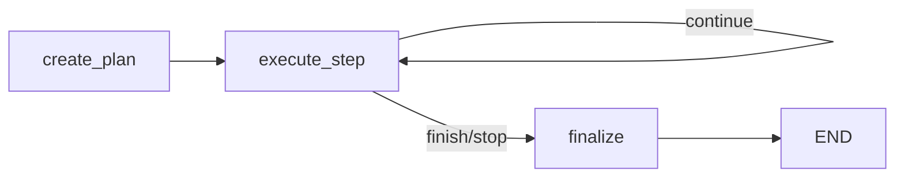

# Module 01 — State and Control Flow

Teaches typed graph state, nodes/edges, conditional routing, loops, and stopping conditions.

## Graph



## Key patterns

- `TypedDict` state with `Annotated[..., add_messages]` reducer
- Pure routing function (`route_after_execute`) — easy to unit test
- Hard stop via `max_steps` guard

## Run

```bash
python scripts/run_01_state.py --goal "Prepare a weekly team update"
python scripts/run_01_state.py --goal "Research a topic" --max-steps 2
```

## Test

```bash
pytest tests/unit/test_01_state_control_flow.py -v
```
