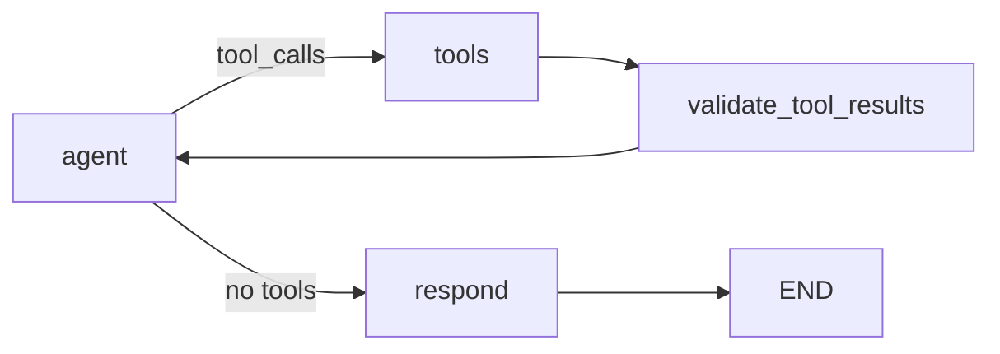

# Module 02 — Tool Use

Teaches clear tool definitions, schemas, failure handling, result validation, and tool-vs-respond routing.

## Graph



## Run

```bash
python scripts/run_02_tools.py --question "What is LangGraph?"
python scripts/run_02_tools.py --question "Calculate (12 + 8) / 4"
```

## Test

```bash
pytest tests/unit/test_02_tool_use.py -v
```
