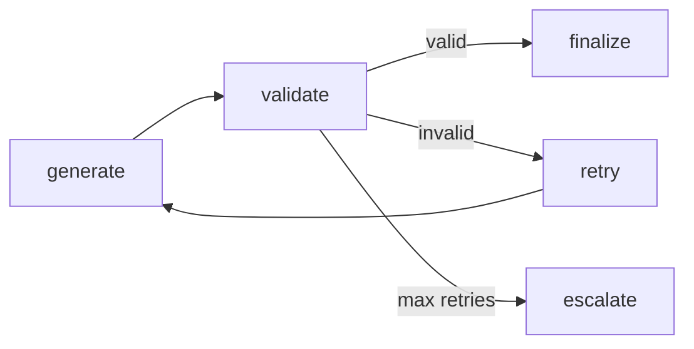

# Module 03 — Structured Outputs

Teaches Pydantic validation at workflow boundaries, retry loops, and separating scratchpad/actions/final output.

## Graph



## Run

```bash
python scripts/run_03_structured.py --topic "LangGraph checkpointing"
```

## Test

```bash
pytest tests/unit/test_03_structured_outputs.py -v
```
