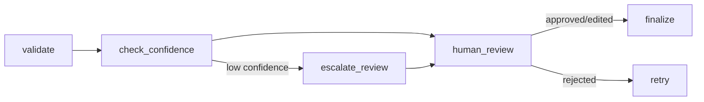

# Module 04 — Human-in-the-Loop

Teaches approval checkpoints, review states, manual correction, and low-confidence escalation with checkpointing.

## Graph



The graph interrupts **before** `human_review`. Resume with a review decision via CLI.

## Run

```bash
python scripts/run_04_hitl.py --thread-id demo-1 --topic "LangGraph HITL patterns"
```

When interrupted, choose approve (`a`), reject (`r`), or edit (`e`).

## Test

```bash
pytest tests/unit/test_04_human_in_the_loop.py -v
```
